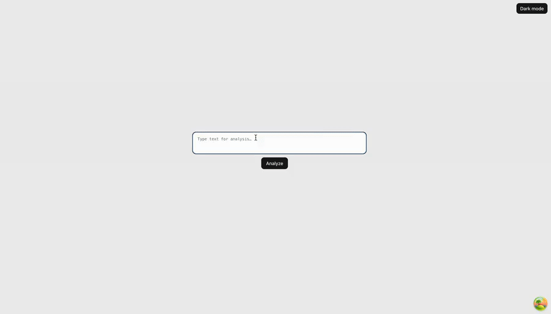

Note: The archive `All_Documents_for_grading.zip` includes everything needed, including the `.ipynb` notebooks and the exported files for each model.

# The Ardor Scale — Multi-Model Emotion & Sentiment Analysis

Short demo of the app/workflow:

[▶ Full MP4](docs/demo.mp4)

---

## Overview

**Ardor Scale** classifies text for **sentiment** (polarity) and **emotion** (multi-class).
We compare **classical baselines** (TF-IDF + Logistic Regression/SVM) against **transformers**
(**DistilBERT** multi-head for sentiment+emotion jointly, and **RoBERTa** fine-tuned as two
separate models).

## Why this matters

-   **Baselines** are fast and simple (good word/n-gram patterns).
-   **Transformers** capture **context** across sentences via self-attention → higher quality on nuanced language.

## Datasets

-   Public Kaggle sources for **emotion** (~6 classes) and **sentiment**.
-   Standard cleaning: lowercase, strip URLs/special chars/extra spaces, dedupe, handle missing labels.
-   Train/val/test split with attention to **class imbalance**.

## Models

**Classical**

-   Features: **TF-IDF weighting** (1–2-gram).
-   Classifiers: **Logistic Regression**, **SVM** (linear/RBF tuned per task).

**Transformers**

-   **DistilBERT (multi-head):** one shared encoder, two classifier heads (sentiment, emotion).
-   **RoBERTa (dual models):** one model for sentiment, one for emotion.

## Training Setup (Transformers)

-   Optimizer: **AdamW** (adaptive LR + weight decay).
-   Typical hyperparams: `lr=3e-5`, batch size chosen per GPU RAM, **early stopping**, fixed seed `42`.
-   **Class weighting** in loss (for imbalance) where applicable.

## Evaluation

-   Metrics reported per task: **Accuracy**, **Precision**, **Recall**, **Macro-F1**
